# 29280_revenue_administration_db
to build database of revenue_administration_db

# Revenue Administration Database

##  Project Overview

A PostgreSQL database project designed to manage revenue administration information, including taxpayers, taxes, declarations, assessments, payments, audits, penalties, refunds, and revenue targets.

##  Technologies

- PostgreSQL
- SQL
- GitHub

##  Database Tables

The database contains 20 tables:

- TAXPAYER
- TAX_CENTRE
- TAX_TYPE
- BANK
- TAX_OFFICER
- BUSINESS
- PROPERTY
- VEHICLE
- TAX_REGISTRATION
- TAX_PERIOD
- TAX_DECLARATION
- TAX_ASSESSMENT
- TAX_PAYMENT
- PENALTY
- TAX_AUDIT
- AUDIT_FINDING
- TAX_REFUND
- TAX_OBJECTION
- ENFORCEMENT_CASE
- REVENUE_TARGET

##  Database Design

The project includes:
- Primary and foreign keys
- One-to-many relationships
- Many-to-many relationships
- Referential integrity
- Entity Relationship Diagram (ERD)

### ERD

Add your ERD screenshot here:


##  SQL Queries

The project demonstrates:

- INNER JOIN
- LEFT JOIN
- RIGHT JOIN
- GROUP BY
- HAVING
- WHERE
- COUNT()
- SUM()
- AVG()
- MIN()
- MAX()
- COALESCE()

## 📸 Query Outputs

Screenshots of the results obtained from the SQL queries are provided below.

### Query 1 

```sql
SELECT
    tp.taxpayer_tin,
    tp.taxpayer_name,
    tp.taxpayer_type,
    tt.tax_type_name,
    tt.filing_frequency,
    tc.centre_name,
    tc.district_name,
    SUM(td.declared_amount) AS total_declared,
    SUM(ta.assessed_amount) AS total_assessed,
    SUM(COALESCE(pay.payment_amount,0)) AS total_payment
FROM TAXPAYER tp
INNER JOIN TAX_REGISTRATION tr
ON tp.taxpayer_id = tr.taxpayer_id
INNER JOIN TAX_TYPE tt
ON tr.tax_type_id = tt.tax_type_id
INNER JOIN TAX_CENTRE tc
ON tr.tax_centre_id = tc.tax_centre_id
INNER JOIN TAX_DECLARATION td
ON tr.registration_id = td.registration_id
INNER JOIN TAX_ASSESSMENT ta
ON td.declaration_id = ta.declaration_id
LEFT JOIN TAX_PAYMENT pay
ON ta.assessment_id = pay.assessment_id
GROUP BY
tp.taxpayer_tin,
tp.taxpayer_name,
tp.taxpayer_type,
tt.tax_type_name,
tt.filing_frequency,
tc.centre_name,
tc.district_name
HAVING SUM(ta.assessed_amount) > 1000000;
```

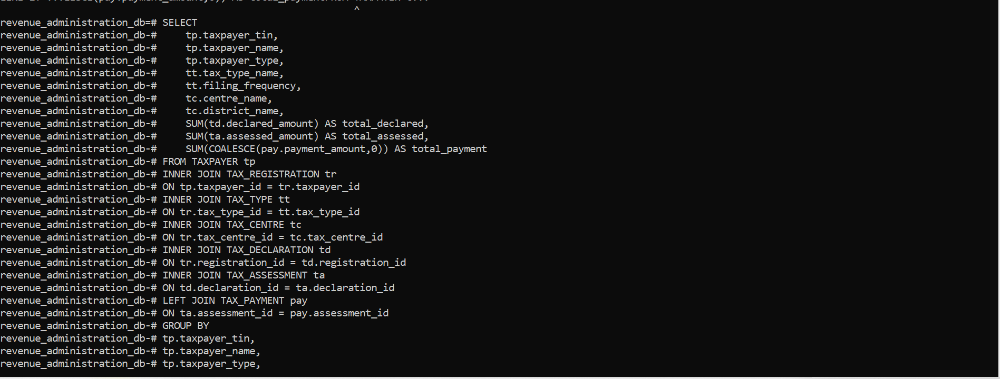

### Query 2 
```sql
SELECT
tp.taxpayer_tin,
tp.taxpayer_name,
tp.registration_date,
tt.tax_type_name,
tr.registration_date,
tc.centre_name,
COUNT(td.declaration_id) AS number_of_declarations,
COALESCE(SUM(td.declared_amount),0) AS total_declared
FROM TAXPAYER tp
LEFT JOIN TAX_REGISTRATION tr
ON tp.taxpayer_id=tr.taxpayer_id
LEFT JOIN TAX_TYPE tt
ON tr.tax_type_id=tt.tax_type_id
LEFT JOIN TAX_CENTRE tc
ON tr.tax_centre_id=tc.tax_centre_id
LEFT JOIN TAX_DECLARATION td
ON tr.registration_id=td.registration_id
GROUP BY
tp.taxpayer_tin,
tp.taxpayer_name,
tp.registration_date,
tt.tax_type_name,
tr.registration_date,
tc.centre_name
HAVING COUNT(td.declaration_id)<3;
```


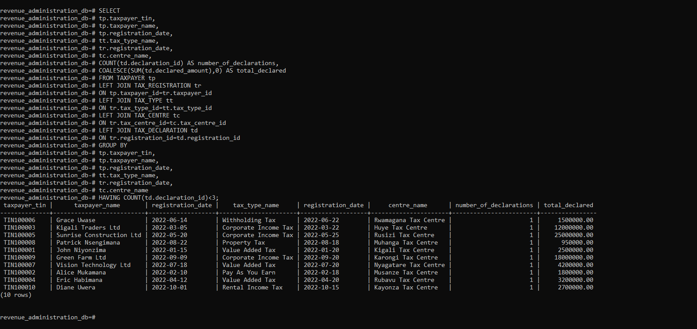

### Query 3 
```sql
SELECT
tt.tax_type_id,
tt.tax_type_name,
tt.filing_frequency,
COUNT(tr.registration_id) AS registered_taxpayers,
COALESCE(SUM(td.declared_amount),0) AS total_declared,
COALESCE(SUM(ta.assessed_amount),0) AS total_assessed
FROM TAX_REGISTRATION tr
RIGHT JOIN TAX_TYPE tt
ON tr.tax_type_id=tt.tax_type_id
LEFT JOIN TAX_DECLARATION td
ON tr.registration_id=td.registration_id
LEFT JOIN TAX_ASSESSMENT ta
ON td.declaration_id=ta.declaration_id
GROUP BY
tt.tax_type_id,
tt.tax_type_name,
tt.filing_frequency
HAVING COALESCE(SUM(td.declared_amount),0)<5000000;
```

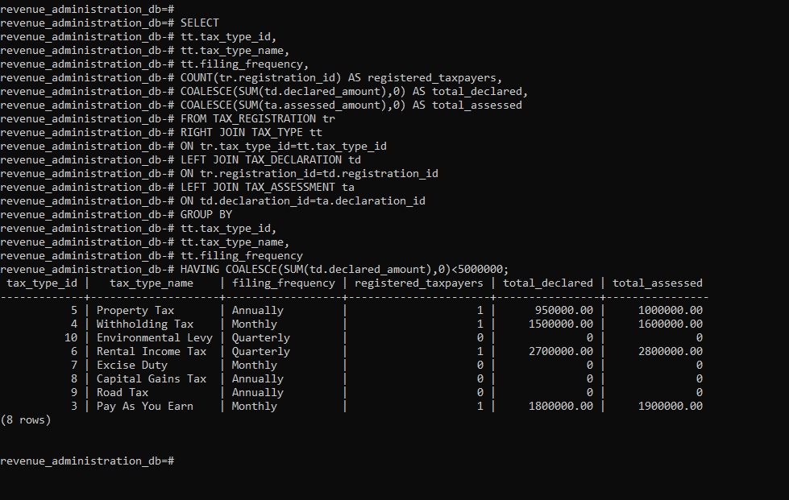

### query 4

```sql
SELECT
tp.taxpayer_tin,
tp.taxpayer_name,
b.business_name,
b.business_sector,
tt.tax_type_name,
tc.centre_name,
SUM(td.declared_amount) total_declared,
SUM(ta.assessed_amount) total_assessed,
SUM(pay.payment_amount) total_payment,
SUM(p.penalty_amount) total_penalty
FROM TAXPAYER tp
INNER JOIN BUSINESS b
ON tp.taxpayer_id=b.taxpayer_id
INNER JOIN TAX_REGISTRATION tr
ON tp.taxpayer_id=tr.taxpayer_id
INNER JOIN TAX_TYPE tt
ON tr.tax_type_id=tt.tax_type_id
INNER JOIN TAX_CENTRE tc
ON tr.tax_centre_id=tc.tax_centre_id
INNER JOIN TAX_DECLARATION td
ON tr.registration_id=td.registration_id
INNER JOIN TAX_ASSESSMENT ta
ON td.declaration_id=ta.declaration_id
LEFT JOIN TAX_PAYMENT pay
ON ta.assessment_id=pay.assessment_id
LEFT JOIN PENALTY p
ON ta.assessment_id=p.assessment_id
GROUP BY
tp.taxpayer_tin,
tp.taxpayer_name,
b.business_name,
b.business_sector,
tt.tax_type_name,
tc.centre_name
HAVING SUM(ta.assessed_amount)>10000000;
```
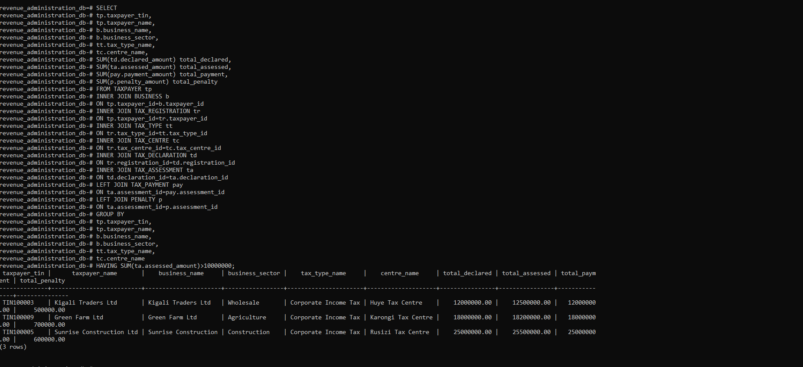

### query 5

```sql
SELECT
tp.taxpayer_tin,
tp.taxpayer_name,
pr.property_location,
pr.property_value,
COUNT(td.declaration_id) number_of_declarations,
SUM(ta.assessed_amount) total_assessed,
COALESCE(SUM(pay.payment_amount),0) total_payment
FROM PROPERTY pr
LEFT JOIN TAXPAYER tp
ON pr.taxpayer_id=tp.taxpayer_id
LEFT JOIN TAX_REGISTRATION tr
ON tp.taxpayer_id=tr.taxpayer_id
LEFT JOIN TAX_DECLARATION td
ON tr.registration_id=td.registration_id
LEFT JOIN TAX_ASSESSMENT ta
ON td.declaration_id=ta.declaration_id
LEFT JOIN TAX_PAYMENT pay
ON ta.assessment_id=pay.assessment_id
GROUP BY
tp.taxpayer_tin,
tp.taxpayer_name,
pr.property_location,
pr.property_value
HAVING COALESCE(SUM(pay.payment_amount),0)<SUM(ta.assessed_amount);
```
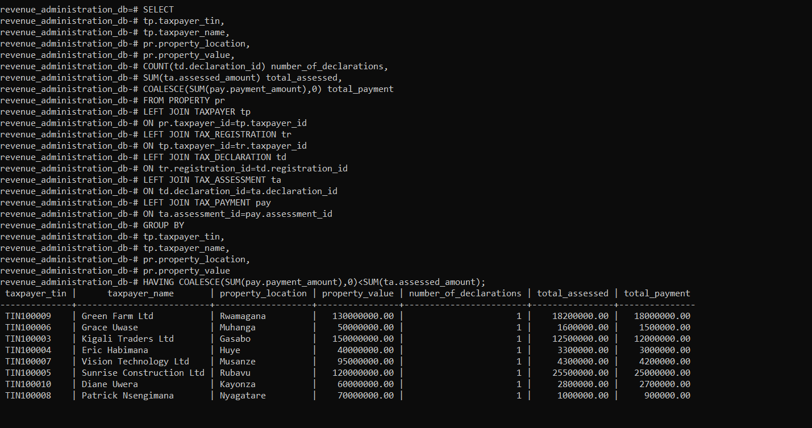
### query 6

```sql
SELECT
    tp.taxpayer_tin,
    tp.taxpayer_name,
    v.plate_number,
    v.vehicle_value,
    tt.tax_type_name,
    COUNT(td.declaration_id) AS number_of_declarations,
    COALESCE(SUM(td.declared_amount),0) AS total_declared,
    COALESCE(SUM(ta.assessed_amount),0) AS total_assessed,
    COALESCE(SUM(p.penalty_amount),0) AS total_penalties
FROM TAXPAYER tp
RIGHT JOIN VEHICLE v
ON tp.taxpayer_id = v.taxpayer_id
LEFT JOIN TAX_REGISTRATION tr
ON tp.taxpayer_id = tr.taxpayer_id
LEFT JOIN TAX_TYPE tt
ON tr.tax_type_id = tt.tax_type_id
LEFT JOIN TAX_DECLARATION td
ON tr.registration_id = td.registration_id
LEFT JOIN TAX_ASSESSMENT ta
ON td.declaration_id = ta.declaration_id
LEFT JOIN PENALTY p
ON ta.assessment_id = p.assessment_id
GROUP BY
tp.taxpayer_tin,
tp.taxpayer_name,
v.plate_number,
v.vehicle_value,
tt.tax_type_name
HAVING v.vehicle_value > 10000000;
```
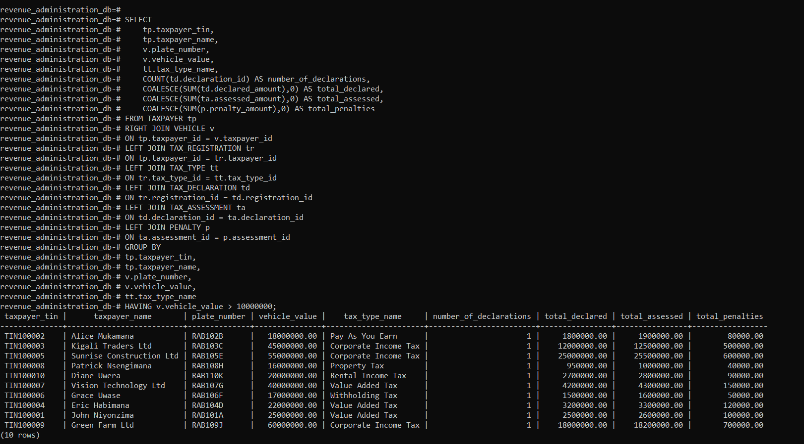
### query 7
```sql
SELECT
    tp.taxpayer_tin,
    tp.taxpayer_name,
    tt.tax_type_name,
    per.period_start_date,
    per.period_end_date,
    per.filing_due_date,
    COUNT(td.declaration_id) AS declarations,
    SUM(td.declared_amount) AS total_declared,
    SUM(ta.assessed_amount) AS total_assessed,
    COALESCE(SUM(pay.payment_amount),0) AS total_paid,
    SUM(ta.assessed_amount)-COALESCE(SUM(pay.payment_amount),0)
        AS outstanding_balance
FROM TAXPAYER tp
INNER JOIN TAX_REGISTRATION tr
ON tp.taxpayer_id=tr.taxpayer_id
INNER JOIN TAX_TYPE tt
ON tr.tax_type_id=tt.tax_type_id
INNER JOIN TAX_DECLARATION td
ON tr.registration_id=td.registration_id
INNER JOIN TAX_PERIOD per
ON td.tax_period_id=per.tax_period_id
INNER JOIN TAX_ASSESSMENT ta
ON td.declaration_id=ta.declaration_id
LEFT JOIN TAX_PAYMENT pay
ON ta.assessment_id=pay.assessment_id
GROUP BY
tp.taxpayer_tin,
tp.taxpayer_name,
tt.tax_type_name,
per.period_start_date,
per.period_end_date,
per.filing_due_date
HAVING
SUM(ta.assessed_amount)-COALESCE(SUM(pay.payment_amount),0)>0;
```
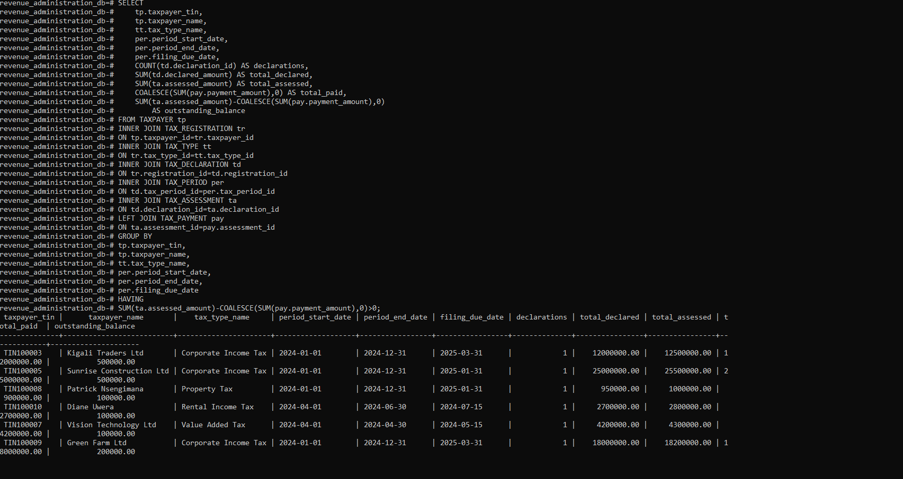
### query 8
```sql
SELECT
    tp.taxpayer_tin,
    tp.taxpayer_name,
    a.audit_status,
    o.officer_name,
    c.centre_name,
    t.tax_type_name,
    COUNT(f.finding_id) AS findings,
    COALESCE(SUM(f.finding_amount),0) AS total_finding
FROM TAXPAYER tp
LEFT JOIN TAX_AUDIT a
ON tp.taxpayer_id=a.taxpayer_id
LEFT JOIN TAX_OFFICER o
ON a.officer_id=o.officer_id
LEFT JOIN TAX_CENTRE c
ON o.tax_centre_id=c.tax_centre_id
LEFT JOIN AUDIT_FINDING f
ON a.audit_id=f.audit_id
LEFT JOIN TAX_TYPE t
ON f.tax_type_id=t.tax_type_id
GROUP BY
tp.taxpayer_tin,
tp.taxpayer_name,
a.audit_status,
o.officer_name,
c.centre_name,
t.tax_type_name
HAVING COALESCE(SUM(f.finding_amount),0)>2000000;
```
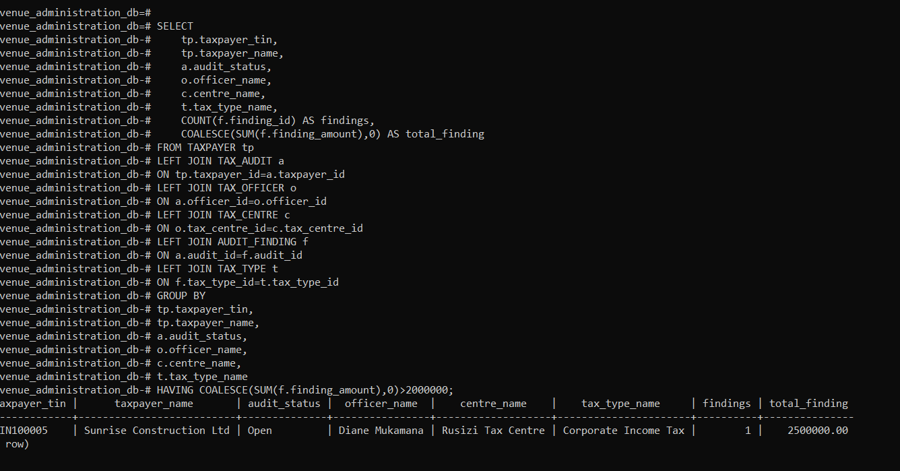
### query 9
```sql
SELECT
    o.officer_id,
    o.officer_name,
    o.officer_position,
    c.centre_name,
    c.district_name,
    COUNT(a.audit_id) AS audits,
    COALESCE(SUM(f.finding_amount),0) AS total_finding,
    COALESCE(AVG(f.finding_amount),0) AS average_finding
FROM TAX_AUDIT a
RIGHT JOIN TAX_OFFICER o
ON a.officer_id=o.officer_id
LEFT JOIN TAX_CENTRE c
ON o.tax_centre_id=c.tax_centre_id
LEFT JOIN AUDIT_FINDING f
ON a.audit_id=f.audit_id
GROUP BY
o.officer_id,
o.officer_name,
o.officer_position,
c.centre_name,
c.district_name
HAVING COALESCE(AVG(f.finding_amount),0)>500000;

```
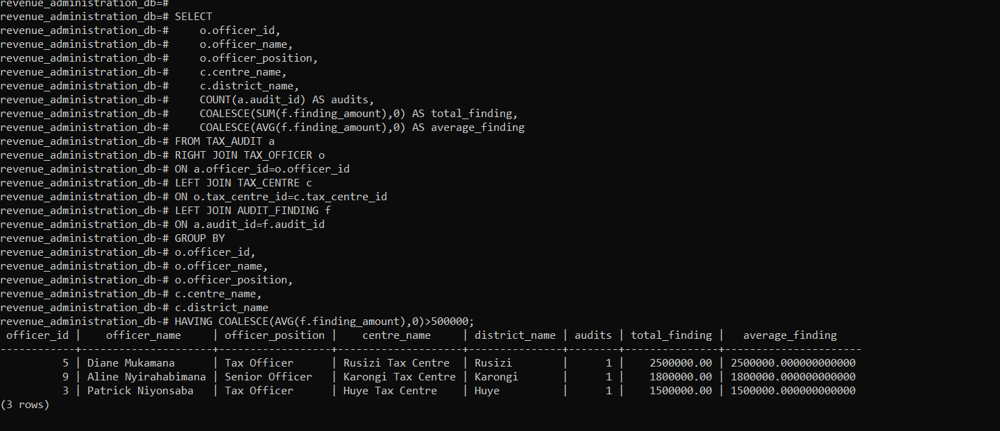
### query 10
```sql
SELECT
    tp.taxpayer_tin,
    tp.taxpayer_name,
    a.assessment_id,
    a.assessment_date,
    a.assessed_amount,
    o.objection_status,
    COALESCE(SUM(pay.payment_amount),0) AS total_payment,
    COALESCE(SUM(p.penalty_amount),0) AS total_penalty
FROM TAX_ASSESSMENT a
INNER JOIN TAX_DECLARATION d
ON a.declaration_id=d.declaration_id
INNER JOIN TAX_REGISTRATION r
ON d.registration_id=r.registration_id
INNER JOIN TAXPAYER tp
ON r.taxpayer_id=tp.taxpayer_id
INNER JOIN TAX_OBJECTION o
ON a.assessment_id=o.assessment_id
LEFT JOIN TAX_PAYMENT pay
ON a.assessment_id=pay.assessment_id
LEFT JOIN PENALTY p
ON a.assessment_id=p.assessment_idSELECT
    tp.taxpayer_tin,
    tp.taxpayer_name,
    ta.assessment_id,
    ta.assessed_amount,
    COUNT(ob.objection_id) AS number_of_objections,
    COALESCE(SUM(pay.payment_amount),0) AS total_payment,
    (ta.assessed_amount - COALESCE(SUM(pay.payment_amount),0)) AS outstanding_balance
FROM TAX_ASSESSMENT ta
INNER JOIN TAX_DECLARATION td
ON ta.declaration_id = td.declaration_id
INNER JOIN TAX_REGISTRATION tr
ON td.registration_id = tr.registration_id
INNER JOIN TAXPAYER tp
ON tr.taxpayer_id = tp.taxpayer_id
LEFT JOIN TAX_OBJECTION ob
ON ta.assessment_id = ob.assessment_id
LEFT JOIN TAX_PAYMENT pay
ON ta.assessment_id = pay.assessment_id
GROUP BY
tp.taxpayer_tin,
tp.taxpayer_name,
ta.assessment_id,
ta.assessed_amount
HAVING
(ta.assessed_amount - COALESCE(SUM(pay.payment_amount),0)) > 500000;
GROUP BY
tp.taxpayer_tin,
tp.taxpayer_name,
a.assessment_id,
a.assessment_date,
a.assessed_amount,
o.objection_status
HAVING COALESCE(SUM(p.penalty_amount),0)>100000;
```
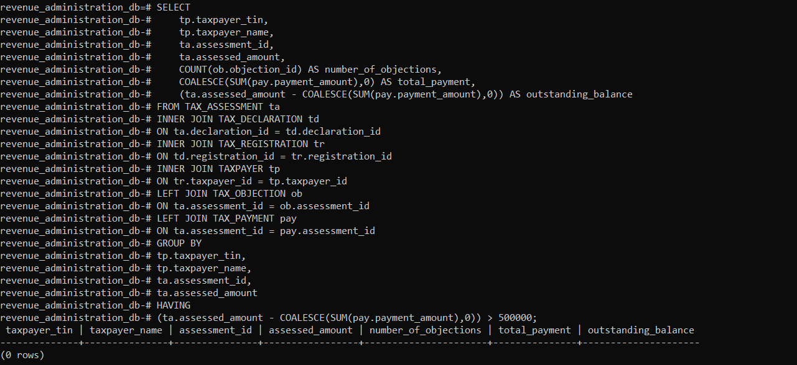
### query 11
```sql
SELECT
    tp.taxpayer_tin,
    tp.taxpayer_name,
    ta.assessment_id,
    ta.assessed_amount,
    COUNT(ob.objection_id) AS number_of_objections,
    COALESCE(SUM(pay.payment_amount),0) AS total_payment,
    (ta.assessed_amount - COALESCE(SUM(pay.payment_amount),0)) AS outstanding_balance
FROM TAX_ASSESSMENT ta
INNER JOIN TAX_DECLARATION td
ON ta.declaration_id = td.declaration_id
INNER JOIN TAX_REGISTRATION tr
ON td.registration_id = tr.registration_id
INNER JOIN TAXPAYER tp
ON tr.taxpayer_id = tp.taxpayer_id
LEFT JOIN TAX_OBJECTION ob
ON ta.assessment_id = ob.assessment_id
LEFT JOIN TAX_PAYMENT pay
ON ta.assessment_id = pay.assessment_id
GROUP BY
tp.taxpayer_tin,
tp.taxpayer_name,
ta.assessment_id,
ta.assessed_amount
HAVING
(ta.assessed_amount - COALESCE(SUM(pay.payment_amount),0)) > 500000;
```

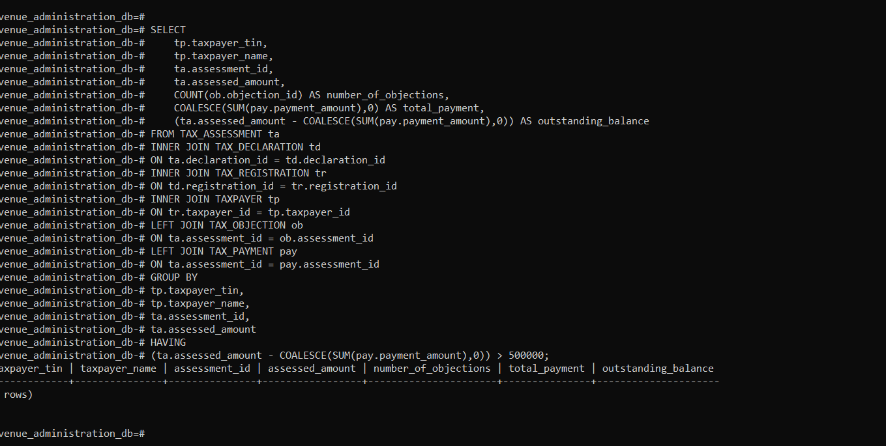
### query 12
```sql
SELECT
    b.bank_id,
    b.bank_name,
    b.bank_code,
    b.branch_name,
    COUNT(tp.payment_id) AS number_of_payments,
    COALESCE(SUM(tp.payment_amount),0) AS total_payment,
    COALESCE(AVG(tp.payment_amount),0) AS average_payment,
    COALESCE(MAX(tp.payment_amount),0) AS maximum_payment,
    COALESCE(MIN(tp.payment_amount),0) AS minimum_payment
FROM TAX_PAYMENT tp
RIGHT JOIN BANK b
ON tp.bank_id = b.bank_id
GROUP BY
b.bank_id,
b.bank_name,
b.bank_code,
b.branch_name
HAVING
COALESCE(SUM(tp.payment_amount),0) < 20000000;
```
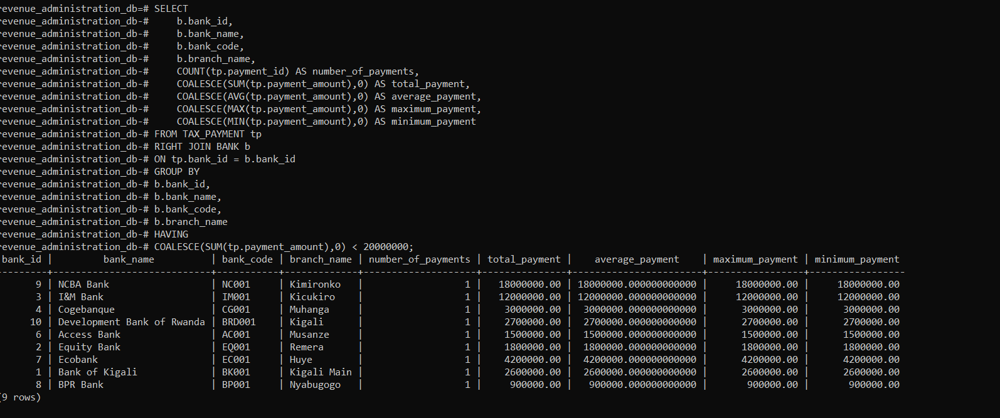


##  Project Structure

```text
revenue-administration-database/
│
├── README.md
├── sql/
│   ├── create_tables.sql
│   ├── insert_data.sql
│   └── queries.sql
│
└── screenshots/
    ├── erd.png
    ├── query1.png
    ├── query2.png
    └── query3.png
